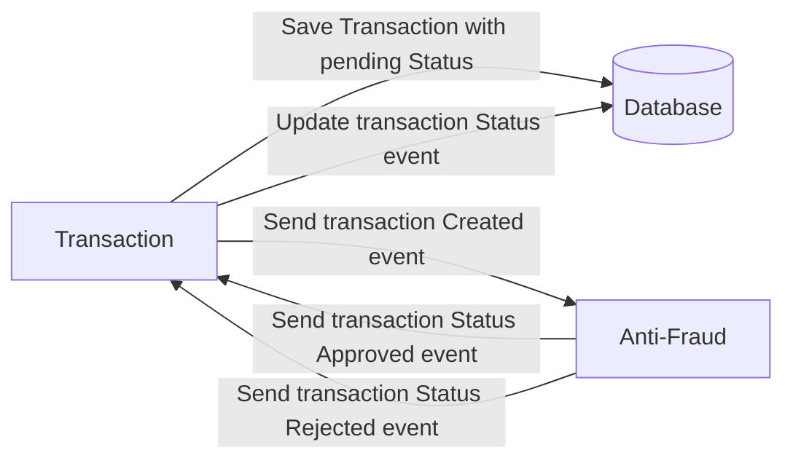
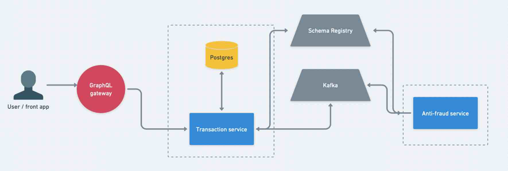
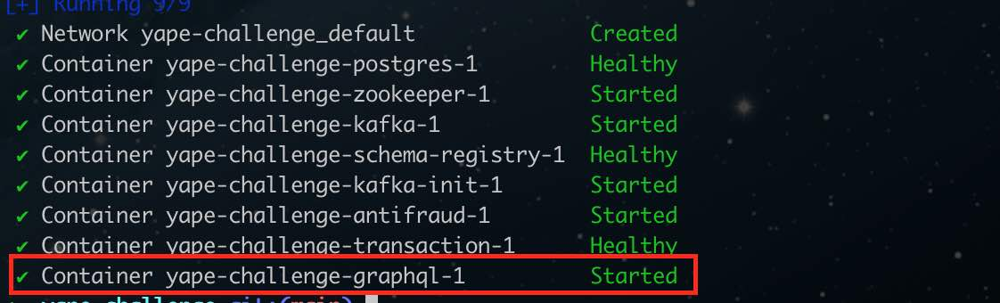

# Yape Code Challenge :rocket:

Our code challenge will let you marvel us with your Jedi coding skills :smile:.

Don't forget that the proper way to submit your work is to fork the repo and create a PR :wink: ... have fun !!

- [Problem](#problem)
- [Tech Stack](#tech_stack)
- [Send us your challenge](#send_us_your_challenge)

# Problem

Every time a financial transaction is created it must be validated by our anti-fraud microservice and then the same service sends a message back to update the transaction status.
For now, we have only three transaction statuses:

<ol>
  <li>pending</li>
  <li>approved</li>
  <li>rejected</li>
</ol>

Every transaction with a value greater than 1000 should be rejected.



# Tech Stack

<ol>
  <li>Node. You can use any framework you want (i.e. Nestjs with an ORM like TypeOrm or Prisma) </li>
  <li>Any database</li>
  <li>Kafka</li>
</ol>

We do provide a `Dockerfile` to help you get started with a dev environment.

You must have two resources:

1. Resource to create a transaction that must containt:

```json
{
  "accountExternalIdDebit": "Guid",
  "accountExternalIdCredit": "Guid",
  "tranferTypeId": 1,
  "value": 120
}
```

2. Resource to retrieve a transaction

```json
{
  "transactionExternalId": "Guid",
  "transactionType": {
    "name": ""
  },
  "transactionStatus": {
    "name": ""
  },
  "value": 120,
  "createdAt": "Date"
}
```

## Optional

You can use any approach to store transaction data but you should consider that we may deal with high volume scenarios where we have a huge amount of writes and reads for the same data at the same time. How would you tackle this requirement?

You can use Graphql;

# Send us your challenge

When you finish your challenge, after forking a repository, you **must** open a pull request to our repository. There are no limitations to the implementation, you can follow the programming paradigm, modularization, and style that you feel is the most appropriate solution.

If you have any questions, please let us know.

# Manual Guide
This section is divided in 3 main sections:
  1. Architecture
  2. How to run the solution
  3. How to use the solution

## 1. Architecture


## 2. How to run the solution
There are 2 ways for running the solution:
  - Option A: Running a fully dockerized solution (the quickest one).
  - Option B: Running only postgres, kafka related nodes in Docker, and the rest in the local machine.

### Option A: Running a fully dockerized solution
This is the quickest way to run the solution. For bringing the solution up and running, you need to exectute the following command from the project root directory:
```bash
docker compose up -d
````
After running the command you should wait for all the services get started. An indication that the solution is fully ready is that the ___graphql_ service is `Started`__ :



__NOTE:__ Sometimes some services can take a little bit on change its status to `Started`, please be patient.

__NOTE:__ Sometimes some services can fail at starting, mostly due timeouts on the healthchecking process. If that happens, please run:

```bash
  docker compose down && docker compose up -d
```

### Option B: Running only postgres, kafka related nodes in Docker, and the rest in the local machine.
This option allows you to run (in dev mode) many instances of one single service by just executing the start command many times. Eventhough, it will be necessary to add `.env` files for them (use the `.env.example` one as a template).

For this, first you should remove the following services from the `docker-compose.yml` file:
  - `antifraud`
  - `transaction`
  - `graphql`

  Then you can bring up the part of the solution up by running:
  ```bash
  docker compose up -d
  ```

  Then you should set enviroment variables (check the `.env.example` as a help in each folder).

  Once all docker services are up and running then you can start running the other 3 locally: `antifraud`, `transaction` and  `graphql`.

  For each one you should run `yarn install && yarn dev` or `yarn install && yarn build && yarn start` (if you go for the second one, you should first provide env vars in the same terminal session) from the respective folder. The solution was coded using __Node v18__.

## 3. How to use the solution
Once the solution is up, you can go to `http://localhost:4000`, this is the "front-door access to the solution backend" for any client or frontend app. This deploys an Apollo GraphQL Playground. You can explore and use the queries and mutations.

It's __highly recommended__ to first check the
`TransactionTypes()` query, since this reveals all the possible values that can be sent for the _transactionType_ param in the `createTransaction` mutation.

Any doubt, don't hesitate in contacting me.